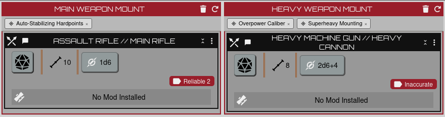
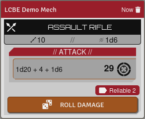
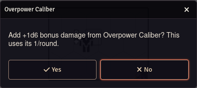
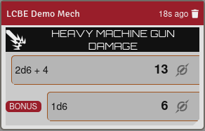

# Lancer Core Bonus Enhancements

A [Foundry VTT](https://foundryvtt.com/) module for the
[LANCER](https://foundryvtt.com/packages/lancer) system that adds mechanical
support for the mount- and weapon-scoped core bonuses the system leaves to manual
adjudication — implementing the request in
[foundryvtt-lancer#724](https://github.com/Eranziel/foundryvtt-lancer/issues/724).

It does this **as a standalone module**: no system fork, no patched files, no
world migration. It uses LANCER's documented extension points
(`lancer.registerFlows`, the sheet render hook) and stores its data in an actor
flag.

## What it does

| Core bonus | Behaviour |
| --- | --- |
| **Auto-Stabilizing Hardpoints** | Pin it to a mount. Attacks with any weapon on that mount get **+1 Accuracy**, pre-filled in the Accuracy/Difficulty dialog (still adjustable). |
| **Overpower Caliber** | Pin it to a mount. When you roll damage for a weapon on that mount **after a hit**, once per round it asks whether to add **+1d6 bonus damage**; saying yes adds it to the damage HUD and spends the 1/round. It frees up when the combat round advances. |
| **Superheavy Mounting** | Pin + display only, by design — it grants an extra mount, which the mount controls already handle. |

## Install

Manifest URL:

```
https://github.com/KingOfPoptart/lancer-core-bonus-enhancements/releases/latest/download/module.json
```

Requires the LANCER system 3.0.0+ and Foundry v13. Built and tested against
LANCER 3.1.3.

## Screenshots

Core bonuses pinned to weapon mounts on the mech sheet — Auto-Stabilizing
Hardpoints on the Main mount, Overpower Caliber and Superheavy Mounting on the
Heavy mount:



**Auto-Stabilizing Hardpoints** adds its +1 Accuracy die to every attack with a
weapon on the mount (`1d20 + grit + 1d6`):



**Overpower Caliber** — when you roll damage after a hit, once per round it asks
whether to spend the +1d6:



Choose "Yes" and the bonus die is added to the damage roll:



## Pinning a core bonus to a mount

**Drag the core bonus item onto the weapon mount** on the mech sheet — from a
compendium, the pilot's sheet, the sidebar, anywhere. The mount card highlights
while you drag over it; drop, and a tag appears under the mount header. Click the
**×** on the tag to remove it.

**On import**, pins are restored automatically. When you import a pilot from a
Comp/Con JSON, each mount's `bonus_effects` (the core bonuses you attached in
Comp/Con) are read and re-pinned to the matching mount on the imported mech.

Only a pilot who actually has the core bonus gets its effect. If a pinned bonus
isn't on the current pilot the tag turns red and the automation stays off until
the pilot has it (or you remove the pin).

## How it works

- **Storage.** Pins live in `mech.flags["lancer-core-bonus-enhancements"].mounts`,
  keyed by a mount signature (`type | fitting sizes | index`), matched strictly.
  Changing a mount's type/fittings, or reordering/inserting mounts ahead of a
  pinned one, drops the pin — re-pin from the sheet.
- **Drag-drop.** Two paths, because the LANCER system's sheet-drop pipeline only
  fires for drags it can resolve into a global drag preview (owned items,
  pilot-sheet refs) — not for Foundry v13 compendium rows (`data-entry-id`).
  Path 1: `LancerMechSheet.prototype.canRootDrop` / `onRootDrop` are extended to
  accept and pin a `core_bonus`. Path 2: capture-phase `dragover`/`drop`
  listeners on the sheet root `preventDefault` over a mount card so `drop` fires,
  then read the native `text/plain` payload and pin. Between them, dropping works
  from the compendium, the pilot sheet and the sidebar.
- **Import.** `LancerPilotSheet.prototype._onPilotJsonParsed` is wrapped so that,
  after the system's import finishes, each Comp/Con mech's mount `bonus_effects`
  are matched to the imported Foundry mount by the weapon it holds, and pinned.
  (Cloud/share-code import is not yet covered — use JSON, or drag the bonus on.)
- **Accuracy.** A `WeaponAttackFlow` step (`…autostabAccuracy`), registered via
  `lancer.registerFlows` and inserted after `initAttackData`, adds `1` to
  `state.data.acc_diff.base.accuracy` before the HUD opens.
- **Bonus damage.** A `DamageRollFlow` step (`…overpowerDamage`) inserted after
  `initDamageData`: on a hit, if Overpower Caliber is pinned + owned + unused
  this round, it prompts to add `{type} 1d6` to `state.data.bonus_damage` and
  records the use against `game.combat.id` + `game.combat.round`.

## Development

Plain ES module — no build step. Symlink or copy the repo into your Foundry
`Data/modules/` directory and enable it in a LANCER world.
`globalThis.lancerCoreBonusEnhancements` exposes the internals for debugging.

## Known limitations

- Pins are position-bound (see Storage above).
- Cloud / share-code pilot import does not auto-restore pins yet; JSON import and
  drag-drop do.
- Overpower Caliber's "when you hit" check treats a target-less damage roll as a
  hit (matching how the system rolls target-less damage), and its 1/round lock is
  only enforced during a tracked encounter.

## Licence

MIT. LANCER is © Massif Press; this is an unofficial third-party module.
