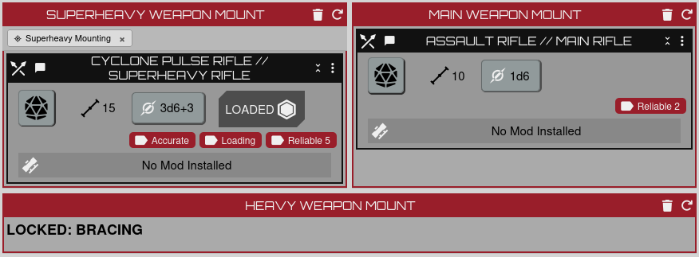

# Lancer Core Bonus Enhancements


[](https://foundryvtt.com/packages/lancer-core-bonus-enhancements)

A [Foundry VTT](https://foundryvtt.com/) module for the
[LANCER](https://foundryvtt.com/packages/lancer) system that adds mechanical
support for the mount- and weapon-scoped core bonuses the system leaves to manual
adjudication — implementing the request in
[foundryvtt-lancer#724](https://github.com/Eranziel/foundryvtt-lancer/issues/724).

It does this **as a standalone module**: no system fork, no patched files, no
world migration. It uses LANCER's documented extension points
(`lancer.registerFlows`, the sheet render hook) and stores its data in an actor
flag.

> **Now on Foundry's official package repository:**
> **[foundryvtt.com/packages/lancer-core-bonus-enhancements](https://foundryvtt.com/packages/lancer-core-bonus-enhancements)**
> — install and update it straight from inside Foundry.

## What it does

| Core bonus | Behaviour |
| --- | --- |
| **Auto-Stabilizing Hardpoints** | Pin it to a mount. Attacks with any weapon on that mount get **+1 Accuracy**, pre-filled in the Accuracy/Difficulty dialog (still adjustable). |
| **Overpower Caliber** | Pin it to a mount. When you roll damage for a weapon on that mount **after a hit**, once per round it asks whether to add **+1d6 bonus damage**; saying yes adds it to the damage HUD and spends the 1/round. It frees up when the combat round advances. |
| **Superheavy Mounting** | Drop it on the mech (anywhere on the sheet) and it **adds a superheavy weapon mount** — but only if the mech has fewer than 3 non-integrated mounts, per the rule. The mount takes *only* superheavy weapons (anything smaller is bounced back out), carries a tag, and removing the tag deletes the mount. Put a superheavy weapon in it and another mount (the Heavy mount, per RAW) is **automatically consumed as Bracing** — and released, with its weapon put back, when the superheavy weapon leaves. |

## Installation

**From inside Foundry (recommended):** open **Add-on Modules → Install Module**, find
**Lancer Core Bonus Enhancements** in the list, and click **Install**. New releases then show up
under the module's **Update** button (or **Update All**).

Prefer a manifest URL? Paste this into the **Manifest URL** box at the bottom of that window instead:

```
https://github.com/KingOfPoptart/lancer-core-bonus-enhancements/releases/latest/download/module.json
```

Then enable **Lancer Core Bonus Enhancements** in your world.

Requires the LANCER system 3.0.0+ and Foundry v13. Built and tested against
LANCER 3.1.3.

## Screenshots

Core bonuses on the mech sheet — Auto-Stabilizing Hardpoints tagged on the Main
mount, Overpower Caliber on the Heavy mount, and the extra Superheavy mount that
Superheavy Mounting added:


**Auto-Stabilizing Hardpoints** adds its +1 Accuracy die to every attack with a
weapon on the mount (`1d20 + grit + 1d6`):


**Overpower Caliber** — when you roll damage after a hit, once per round it asks
whether to spend the +1d6:


Choose "Yes" and the bonus die is added to the damage roll:


**Superheavy Mounting** — putting a superheavy weapon in the added mount consumes
another mount as Bracing automatically (the Heavy mount, per RAW). Here the Heavy
mount is locked to bracing; remove the superheavy weapon and it comes back with
whatever it held:



## Attaching a core bonus

Two ways:

- **Import a pilot from Comp/Con.** Export the pilot to JSON and load it on the
  pilot sheet's RM-4 Sync tab. Each mount's core bonuses are re-attached to the
  matching mech mount automatically. (Cloud / share-code import isn't covered
  yet — use JSON.)
- **Drag the core bonus item onto the mech sheet** — from a compendium, the
  pilot's sheet, or the sidebar. Auto-Stabilizing Hardpoints and Overpower
  Caliber attach to the weapon mount you drop them on; Superheavy Mounting drops
  anywhere and adds its mount.

Click the **×** on a tag to remove it. A bonus only takes effect for a pilot who
actually has it — otherwise the tag turns red and the automation stays off.

## Development

Plain ES module — no build step. Symlink or copy the repo into your Foundry
`Data/modules/` directory and enable it in a LANCER world.
`globalThis.lancerCoreBonusEnhancements` exposes the internals for debugging. The
comment block at the top of `scripts/module.mjs` explains how each piece works,
alongside the known limitations.

## Licence

MIT. LANCER is © Massif Press; this is an unofficial third-party module.
